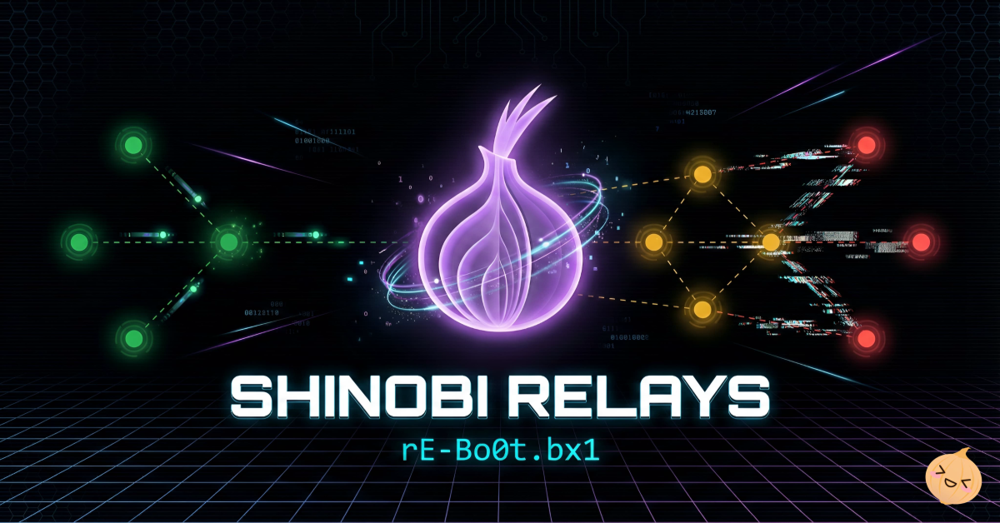

# .:: Shinobi Relays 🥷🧅 ::.

A privacy-focused, static transparency dashboard for the Tor relays and bridges operated by **rE-Bo0t.bx1**.

The site presents operator-owned bridge fingerprints, public relay identities, network locations, platforms, autonomous systems, and live Tor network status in a responsive single-page interface.

<p align="center">
  <a href="https://relays.brokenbotnet.com/">
    
  </a>
</p>

## Live dashboard

- **Website:** [relays.brokenbotnet.com](https://relays.brokenbotnet.com/)
- **Extended metrics:** [metrics.1aeo.com/relays.brokenbotnet.com](https://metrics.1aeo.com/relays.brokenbotnet.com/)
- **AIO Docker Relay deployment stack:** [r3bo0tbx1/tor-guard-relay](https://github.com/r3bo0tbx1/tor-guard-relay/)

## Overview

The repository contains a build-free static website. Relay inventory is stored directly in `index.html`, then enriched in the browser with live data from the Tor Project Onionoo API.

Current inventory represented by the source:

| Category | Count |
| --- | ---: |
| Bridge relays | 8 |
| Public relays | 16 |
| Total relay records | 24 |
| Public relay countries | 15 |
| Operating-system families | 6 |
| Autonomous systems | 11 |

The public inventory currently contains one configured exit relay and fifteen non-exit relays. Guard and middle roles are resolved dynamically from the current Onionoo flags, rather than being treated as permanently fixed roles.

## Features

- Live relay and bridge status from Tor Project Onionoo
- Running, Guard, Exit, Fast, Stable, Valid, HSDir, V2Dir, and StaleDesc flag display
- Live advertised-bandwidth total
- First-seen age and last-seen status handling
- Automatic Guard, Middle, and Exit role classification
- Regional health summaries
- Search by relay name, hostname, country, location, ASN, or fingerprint
- Sorting by configured region, live status, relay type, or country
- Copy buttons for fingerprints, addresses, and relay identity lines
- Responsive relay cards and touch-friendly tooltips
- Tor circuit flow visualization
- Tor terminology glossary and FAQ
- Operator contact, abuse contact, PGP identity, and no-logs statement
- Public relay ownership proofs under `/.well-known/tor-relay/`
- Installable web-app manifest and local icon assets
- Custom cyber-themed `404.html`
- Static-host security headers through `_headers`

## How it works

```text
Browser
  |
  |-- loads static HTML, CSS, JavaScript, icons, and proof files
  |
  |-- reads configured relay inventory from index.html
  |
  `-- requests live relay data from Onionoo
          |
          `-- updates flags, status, bandwidth, age, and role badges
```

### Static data

The `relays` array inside `index.html` contains the operator-maintained inventory.

Public relay records include:

- Nickname and display identity
- Hostname
- RSA identity fingerprint
- IPv4 and IPv6 addresses
- Location and country
- Operating system
- ASN
- Display region

Bridge records include:

- Nickname and display identity
- Hashed bridge fingerprint
- Distribution method
- Bridge capability labels

### Live data

When the page loads or the refresh button is clicked, the browser sends an HTTP GET request to the Tor Project Onionoo API.

The same request can be tested from a terminal using `curl` and `jq`:

```bash
curl --fail \
  --silent \
  --show-error \
  --compressed \
  --get \
  --data-urlencode \
  "lookup=7F28C3E41DA9FD4A2B8143CB6038304634EDC396,A6A2A807338167A5E58F4DD2D4CD0817AF3DD562,0EEE0B1EED5E35E1E3F2575CD0AFF160925FA63F" \
  "https://onionoo.torproject.org/details" |
jq
```

The `lookup` parameter contains a comma-separated list of relay fingerprints. Onionoo returns a JSON details document containing matching public relays under the `relays` array.

A shortened response looks like this:

```json
{
  "relays_published": "2026-07-11 19:00:00",
  "relays": [
    {
      "nickname": "ShinobiKaimon",
      "fingerprint": "0EEE0B1EED5E35E1E3F2575CD0AFF160925FA63F",
      "running": true,
      "flags": [
        "Fast",
        "HSDir",
        "Running",
        "Stable",
        "V2Dir",
        "Valid"
      ],
      "country_name": "Singapore",
      "advertised_bandwidth": 2510144
    }
  ],
  "bridges_published": "2026-07-11 18:53:48",
  "bridges": []
}
```

The website matches each returned record to a configured relay using its fingerprint and updates:

- `running`
- `flags`
- `advertised_bandwidth`
- `first_seen`
- `last_seen`
- Country and autonomous-system information
- Tor version and platform
- Verified hostnames
- IPv4 and IPv6 OR addresses

The `relays_published` value shows when the public relay data was generated. The `bridges_published` value shows when the bridge data was generated.

An empty `bridges` array is expected when the request contains only public relay fingerprints.

Bridges must be queried using their hashed bridge fingerprints:

```bash
curl --fail \
  --silent \
  --show-error \
  --compressed \
  --get \
  --data-urlencode \
  "lookup=<hashed-bridge-fingerprint>" \
  "https://onionoo.torproject.org/details" |
jq
```

Never publish or query a bridge using its unhashed identity fingerprint.

If Onionoo is unavailable, the static inventory remains visible and live fields are shown as unavailable instead of removing relay cards.

Onionoo documentation: [Tor Metrics Onionoo](https://metrics.torproject.org/onionoo.html)

## Repository structure

```text
.
├── .well-known/
│   └── tor-relay/
│       ├── ed25519-family-id.txt
│       ├── ed25519-master-pubkey.txt
│       ├── hashed-bridge-rsa-fingerprint.txt
│       └── rsa-fingerprint.txt
├── src/
│   ├── css/
│   │   ├── 404.css
│   │   └── shinobi.css
│   ├── js/
│   │   ├── lucide.min.js
│   │   └── shinobi.js
│   ├── apple-touch-icon.png
│   ├── favicon-96x96.png
│   ├── favicon.ico
│   ├── favicon.svg
│   ├── og-shinobi.png
│   ├── site.webmanifest
│   ├── web-app-manifest-192x192.png
│   └── web-app-manifest-512x512.png
├── 404.html
├── index.html
├── LICENSE
├── package.json
├── README.md
├── SECURITY.md
├── scripts/
│   ├── build.js
│   └── security-check.js
└── _headers
```

## Local development

No framework, build command, backend, or package install is required. `package.json` only provides helper scripts for syntax and security checks.

Clone the repository and serve its root with any static HTTP server:

```bash
git clone https://github.com/r3bo0tbx1/shinobi-relays.git && cd shinobi-relays
python3 -m http.server 1337
```

Open:

```text
http://localhost:1337/
```

Using a local HTTP server is recommended instead of opening `index.html` through `file://`. Clipboard access and browser security behavior are more reliable on `localhost` or HTTPS.

## Deployment

The repository can be deployed to any static host. Cloudflare Pages is a natural fit because the project already includes a compatible `_headers` file.

### Cloudflare Pages

1. Connect the repository.
2. Set **Framework preset** to `None`.
3. Set **Build command** to `npm run build`.
4. Set **Build output directory** to `shinobi`.
5. Leave **Root directory** empty/default unless the repository is checked out from a subdirectory.
6. Confirm that `_headers` is included in the deployed output.
7. Attach the intended custom domain.
8. Verify the response headers and Onionoo request in browser developer tools.

The build script copies only deployable public files into `shinobi`:

- `index.html`
- `404.html`
- `_headers`
- `_redirects`
- `src/`
- `.well-known/`

Repository files such as `README.md`, `SECURITY.md`, `package.json`, and `scripts/` are intentionally not published.

Cloudflare Pages documentation: [Custom headers](https://developers.cloudflare.com/pages/configuration/headers/)

### Other static hosts

The HTML and assets work on other static servers, but `_headers` is platform-specific. Recreate the same headers in the chosen web server or CDN configuration when the host does not process this file.

## Updating the relay inventory

Relay cards are generated from the `relays` array near the beginning of `src/js/shinobi.js`.

### Public relay example

```js
{
    kind: 'public',
    type: 'middle',
    region: 'asia-oceania',
    name: 'Example',
    emoji: '🧅',
    tooltip: 'Display description',
    host: 'relay.example.com',
    fingerprint: '40_CHARACTER_RSA_FINGERPRINT',
    ipv4: '192.0.2.10',
    ipv6: '2001:db8::10',
    mobileIpv6: '...::10',
    location: 'City, Country',
    country: 'Country',
    os: '🐧 Linux',
    asn: 'AS64500'
}
```

### Bridge example

```js
{
    kind: 'bridge',
    type: 'bridge',
    name: 'Example',
    emoji: '🌉',
    tooltip: 'Display description',
    fingerprint: '40_CHARACTER_HASHED_BRIDGE_FINGERPRINT',
    distribution: '📧 Email'
}
```

After changing the inventory:

1. Update the matching proof files under `.well-known/tor-relay/`.
2. Confirm that each public RSA fingerprint appears exactly once in `rsa-fingerprint.txt`.
3. Confirm that each bridge hashed fingerprint appears exactly once in `hashed-bridge-rsa-fingerprint.txt`.
4. Update the Ed25519 public-key list when public relays are added or removed.
5. Update the family ID file only when the public family identity changes.
6. Review fallback count labels in `fetchRelayFlags()` if the bridge or exit totals change.
7. Load the site locally and verify search, sorting, copy buttons, metrics links, and Onionoo results.

## Relay proof files

The following public files provide operator ownership and family information:

| File | Purpose |
| --- | --- |
| `rsa-fingerprint.txt` | Public RSA identity fingerprints for listed public relays |
| `ed25519-master-pubkey.txt` | Ed25519 master public keys for listed public relays |
| `ed25519-family-id.txt` | Public Tor relay family identifier |
| `hashed-bridge-rsa-fingerprint.txt` | Hashed RSA fingerprints for operated bridges |

These files intentionally contain public identifiers only.

Never commit:

- Relay identity private keys
- Bridge connection lines
- Obfs4 private state
- Family secret signing keys
- Control-port cookies or passwords
- Host credentials or provider API tokens

Tor family documentation: [Configure relay FamilyID](https://community.torproject.org/relay/setup/post-install/family-ids/)

## Security and privacy

The dashboard is designed as a static transparency page with a small client-side attack surface.

See [`SECURITY.md`](SECURITY.md) for reporting details, CSP notes, and the DOM-XSS hardening checklist.

### Current protections

The `_headers` file configures:

- HTTP Strict Transport Security
- Frame embedding denial
- MIME-sniffing protection
- Referrer restrictions
- Search-engine exclusion
- CDN transform opt-out with `Cache-Control: no-transform`
- Permissions Policy restrictions
- Content Security Policy
- No-cache handling for relay proof files
- Cross-origin read access for `/.well-known/*`

The application itself:

- Has no backend
- Has no authentication system
- Stores no cookies
- Uses no `localStorage` or `sessionStorage`
- Contains no forms
- Does not persist visitor searches
- Builds generated relay cards with DOM APIs such as `createElement`, `textContent`, and `replaceChildren`
- Treats Onionoo JSON values as untrusted text before rendering them
- Adds `noopener noreferrer` to links opened in a new tab
- Vendors the Lucide icon library locally
- Opts first-party scripts out of Cloudflare Rocket Loader with `data-cfasync="false"`
- Wraps static email links in Cloudflare `email_off` comments so Email Address Obfuscation does not inject decode scripts
- Includes an automated security regression check in `scripts/security-check.js`

### External connections

The page can connect to:

- `onionoo.torproject.org` for live relay data

Metrics, Tor Project, GitHub, PGP, Mastodon, and email links are only contacted after the visitor follows them.

### Content Security Policy note

The site loads first-party CSS and JavaScript from local files. The deployed CSP in `_headers` does not allow inline scripts, inline event handlers, `unsafe-eval`, or inline style attributes. It also enables Trusted Types enforcement for script sinks in browsers that support it.

Cloudflare Rocket Loader and Email Address Obfuscation should stay disabled or bypassed for this page. Those features inject or rewrite JavaScript/HTML, which conflicts with the site's Trusted Types policy in Chromium browsers.

`X-XSS-Protection` is set to `0` intentionally. The legacy browser XSS Auditor is deprecated, ignored by modern browsers, and has historically caused compatibility and bypass issues. CSP and removal of unsafe DOM sinks are the primary XSS controls.

## Maintenance notes

- Relay addresses, locations, platforms, ASNs, and configured regions are static and must be updated manually.
- Guard status is dynamic. A relay configured as a non-exit may receive or lose the Guard flag without a source-code change.
- Some bridge and exit fallback labels are currently hardcoded in `fetchRelayFlags()`.
- Bridge IPv6 capability is represented as enabled by the UI rather than stored as a per-bridge field.
- The page depends on Onionoo for live state, but degrades gracefully when the API cannot be reached.
- The Open Graph URLs and canonical deployment metadata are specific to `relays.brokenbotnet.com` and should be changed by forks.

## Basic validation

Build the deployable `shinobi/` directory, then check JavaScript syntax and DOM-sink guardrails:

```bash
npm run build
npm run check:js
npm run test:security
```

Check the deployed security headers:

```bash
curl -sSI https://relays.brokenbotnet.com/
```

Check the public proof files:

```bash
curl -fsSL https://relays.brokenbotnet.com/.well-known/tor-relay/rsa-fingerprint.txt
curl -fsSL https://relays.brokenbotnet.com/.well-known/tor-relay/ed25519-master-pubkey.txt
curl -fsSL https://relays.brokenbotnet.com/.well-known/tor-relay/ed25519-family-id.txt
curl -fsSL https://relays.brokenbotnet.com/.well-known/tor-relay/hashed-bridge-rsa-fingerprint.txt
```

## Abuse and operator contact

- **👤 Operator:** `r3bo0tbx1@brokenbotnet.com`
- **🚫 Abuse:** `abuse@brokenbotnet.com`
- **🔑 PGP fingerprint:** `3372 7F53 77D2 96C3 20AF 704A B3BD 6196 E1CF BFB4`

Traffic observed from a listed Tor exit address may originate from a Tor user rather than the relay operator. The operator cannot identify the original user from normal Tor exit traffic and states that relay activity is not logged.

## Disclaimer

This project is an independent relay-operator dashboard. It is not an official Tor Project website and is not endorsed by or affiliated with The Tor Project.


## License

Licensed under the [Apache License 2.0](./LICENSE).
